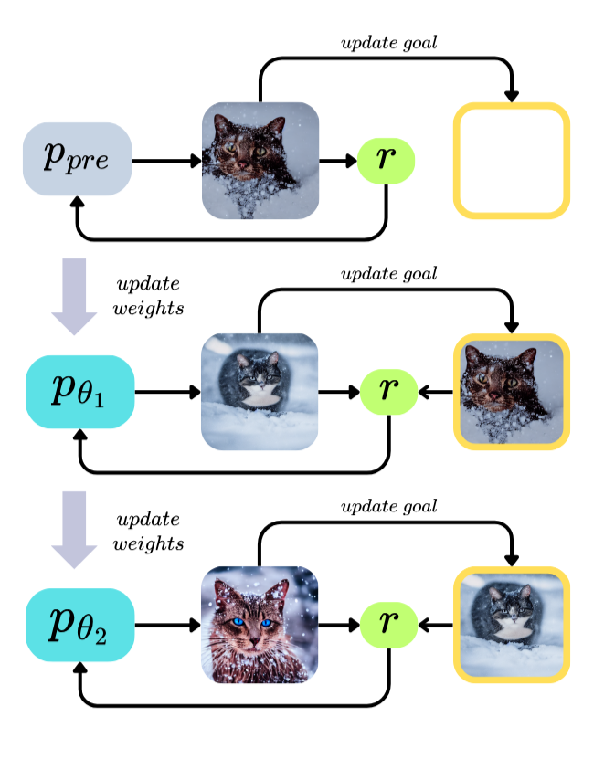
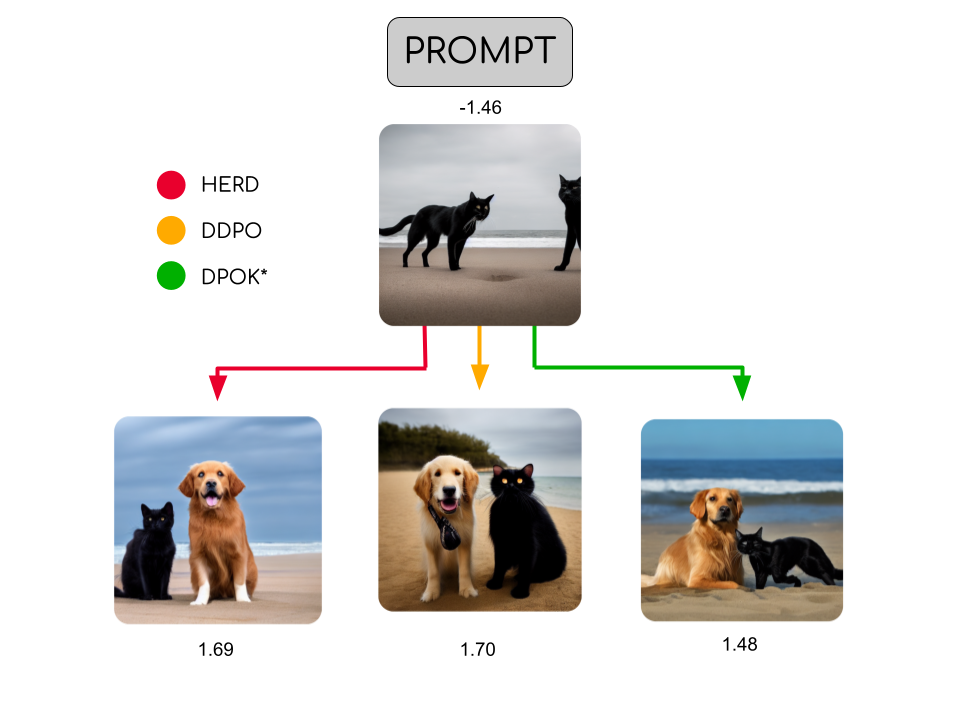

# HERD: Hindsight Experience Replay for Diffusion Models
Finetuning Text to Image Diffusion Models using Reinforcement Learning






### Create Conda environment
```
conda env create -f environment.yml
conda activate rl-train-diffusion
```

### Install Reward model
```
bash install_image_reward.sh
```

## To train model
```
python train.py
```
